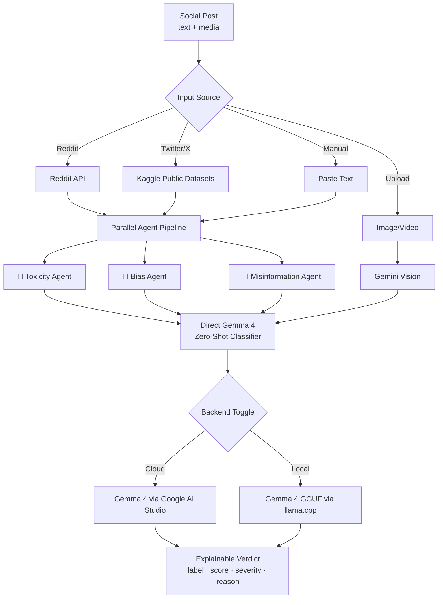

# Emakia — Multi-Agent Content Moderation with Gemma 4

> **A multi-agent system for explainable harassment detection across social platforms — running locally on Gemma 4 open weights, so the people who need it most can use it without sending their pain to someone else's cloud.**

🏆 Submitted to **The Gemma 4 Good Hackathon** · Tracks: **Safety & Trust** + **llama.cpp**
🎥 [Watch the 3-minute video](#)  ·  🌐 [Try the live demo](#)  ·  📄 [Read the paper](#) (AIVR 2026)

---

## The Problem

Every day, journalists, activists, educators, and ordinary people face thousands of harassing messages on Twitter, Facebook, and Instagram. The platforms' built-in moderation is:

- **A black box.** No one knows why a post was flagged or missed.
- **English-first.** Communities outside the global North are routinely under-served.
- **Cloud-only.** Sending harassment to a third-party API for analysis isn't an option for everyone — journalists in surveillance states, abuse survivors, minors, healthcare contexts.
- **Single-signal.** A post is flagged "toxic" or not — no breakdown of *why*.

When Maya, a Lagos-based climate journalist, gets 200 abusive replies a day, she doesn't need a confidence score from a hidden model. She needs to know which messages are credible threats, which are bot-amplified misinformation, which are bias-driven pile-ons — and she needs that reasoning **on her laptop**, not in a US data center.

**That's what Emakia is.**

---

## The Solution

Emakia is a multi-agent moderation system that classifies social-media content along three independent dimensions — toxicity, bias, and misinformation — and explains its reasoning. Every analysis runs through:

1. A **parallel agent ensemble** (toxicity, bias, misinformation specialists)
2. A **direct Gemma 4 zero-shot classifier** for cross-validation
3. A **Gemini Vision pass** for any attached images or videos

The user picks the backend: cloud API (fast, hosted) or **local Gemma 4 via llama.cpp** (private, offline-capable, runs on a laptop).

### Architecture



---

## How We Use Gemma 4

This project uses Gemma 4 in **two complementary ways**, selectable from a single UI toggle:

### Backend 1 — Gemma 4 via Google AI Studio (`gemma-4-26b-a4b-it`)

The 26B mixture-of-experts model serves all three specialist agents (toxicity, bias, misinformation) through Google's hosted API. Each agent gets the same input but a different system prompt focused on its dimension. Results are aggregated and shown to the user.

**Where in the code:** `app.py` lines 473-500 (agent definitions), `app.py` line 265 (`classify_with_gemma4`)

### Backend 2 — Gemma 4 via llama.cpp (open weights, local) 🎯 **llama.cpp track**

Same prompts, same JSON schema, **zero network calls**. Uses `llama-cpp-python` to load a quantized Gemma 4 E2B GGUF (Q4_K_M, ~1.5 GB) directly into the Streamlit container. The user toggles between cloud and local inference at runtime — same UI, same outputs.

**Where in the code:** `kaggle_gemma4_integration.py` — `_load_llama_model()`, `_classify_llama()`

This is the path that matters for journalists in surveillance contexts, healthcare deployments, and offline disaster response (a use case the hackathon explicitly calls out under Global Resilience).

---

## Datasets

We pull from three public Kaggle datasets to demonstrate cross-source generalization, with a fourth slot for any custom slug:

| Dataset | Rows | Labels | Purpose |
|---|---|---|---|
| Trump & Musk Inauguration tweets | 458K | none (unsupervised) | Real-world political discourse stress test |
| Davidson Hate Speech | 25K | hate / offensive / neither | Supervised evaluation with ground truth |
| Hate Speech for Social Media | 1.8K | hateful / offensive / neutral | Cross-dataset agreement check |
| Custom Kaggle slug | any | auto-detected | User-supplied datasets, including upcoming Facebook & Instagram corpora |

Label normalization is documented in `KAGGLE_PUBLIC_DATASETS` in `app.py`. Davidson's `0=hate, 1=offensive` both map to `harassment` (treating offensive language as a sub-class of harassment); `2=neither` maps to `neutral`.

---

## Why Multi-Agent Beats Single-Shot

A single classifier returns one label. A multi-agent ensemble returns three independent perspectives — and **disagreement is itself a signal**. When the toxicity agent says "toxic" but the bias agent says "neutral" and misinformation agent says "accurate," the post is likely insulting but not propagandistic. When all three agree, confidence is high.

The UI shows agreement metrics prominently:
- **Agent Agreement** — do the three specialists concur?
- **Gemma 4 Agreement** — does the zero-shot classifier match the ensemble?
- **🚩 Flagged by Gemma 4** — count of harassment-classified items

This is the "explainable" part of the Safety & Trust submission: the user doesn't just see a verdict, they see *the structure of the disagreement*.

---

## Quick Start

### Prerequisites
- Python 3.11+
- A Google AI Studio API key ([get one here](https://aistudio.google.com/app/apikey))
- A Kaggle API token ([Settings → API → Create New Token](https://www.kaggle.com/settings))
- ~2 GB free disk for the local Gemma 4 GGUF (only if using the local backend)

### Setup (5 minutes)

```bash
# 1. Clone and enter the project
git clone <your-repo-url>
cd adk_hackathon_streamlit_GeminiVision

# 2. Create a virtual environment
python3 -m venv venv
source venv/bin/activate    # macOS/Linux
# venv\Scripts\activate     # Windows

# 3. Install dependencies
pip install -r requirements.txt

# 4. Set up your Kaggle credentials (recommended: native location)
mkdir -p ~/.kaggle
mv ~/Downloads/kaggle.json ~/.kaggle/kaggle.json
chmod 600 ~/.kaggle/kaggle.json

# 5. Set up your Google AI Studio key (any of these works):
mkdir -p .streamlit
cat > .streamlit/secrets.toml <<EOF
GOOGLE_API_KEY  = "your_key_from_aistudio"
KAGGLE_USERNAME = "your_kaggle_username"
KAGGLE_API_TOKEN = "your_kaggle_api_token"
EOF

# 6. Run the app
streamlit run app.py
```

Open `http://localhost:8501` and pick an input mode:
- **Reddit Posts** — live subreddit fetch
- **Paste Text** — analyze any text directly
- **Upload Image / Video** — Gemini Vision moderation
- **📊 Public Kaggle Tweets** — bulk analysis from Kaggle datasets

### Switching to local Gemma 4 (open-weights mode)

Set this in `secrets.toml` or as an environment variable:
```toml
GEMMA4_BACKEND = "llama"
```
The first run will download the GGUF (~1.5 GB) into `/tmp/hf_cache`; subsequent runs use the cached file. No network calls during inference.

---

## Deployment

We support **three deployment paths** to meet different needs:

### 1. Streamlit Community Cloud (free, public demo)
Push to GitHub, connect at [share.streamlit.io](https://share.streamlit.io), paste secrets. URL is live in 2 minutes. See [`DEPLOY.md`](./DEPLOY.md).

### 2. Google Cloud Run (production, scale-to-zero)
```bash
./deploy.sh   # uses Secret Manager, --max-instances 3, free-tier region
```
See [`Dockerfile`](./Dockerfile) and [`deploy.sh`](./deploy.sh) for details. The `--set-secrets` flag pulls credentials from Google Secret Manager at runtime, so no keys touch the image.

### 3. Local laptop (the privacy-first path)
With `GEMMA4_BACKEND=llama`, the app runs end-to-end on a single machine — no API keys required if you stick to local datasets. This is the configuration we recommend for journalists, abuse survivors, and any deployment where data confidentiality matters.

---

## Project Structure

```
adk_hackathon_streamlit_GeminiVision/
├── app.py                          # Main Streamlit app + multi-agent pipeline
├── kaggle_gemma4_integration.py    # Local Gemma 4 backend (llama.cpp + transformers)
├── requirements.txt                # Pinned Python deps
├── Dockerfile                      # Cloud Run / local container build
├── .dockerignore                   # Keeps secrets and venv out of images
├── deploy.sh                       # gcloud run deploy with Secret Manager
├── DEPLOY.md                       # Streamlit Cloud deployment guide
├── ingest/
│   ├── reddit_fetcher.py           # Reddit API client
│   ├── bigquery_fetcher.py         # (Future) BigQuery integration
│   └── content_parser.py           # Text normalization
├── tools/                          # Agent tools / utilities
└── compare/                        # Cross-dataset evaluation scripts
```

---

## Roadmap — Toward the Larger Emakia System

This hackathon submission is a **vertical slice** of a larger system in development:

- **✅ Twitter/X** — three Kaggle datasets integrated, label-normalized
- **🔜 Facebook** — Kaggle dataset slot ready, awaiting label-schema mapping
- **🔜 Instagram** — same architecture, vision-heavy
- **🔬 Cross-platform calibration** — when Davidson labels a post "offensive" and Facebook labels something similar "harassment," whose threshold do we trust? (This is a key research question in the AIVR2026 paper.)
- **🛠️ Linguistic expansion** — the current agents are English-prompted; multilingual variants are planned, especially for African and South Asian languages where platform moderation is weakest.

The bigger Emakia vision is a **moderation cooperative** — small platforms, journalist collectives, and language communities sharing a common open-weight inference backbone, with regional teams owning their own thresholds and labels. This hackathon submission is the proof that the inference layer can run anywhere — from a researcher's laptop to a regional Cloud Run instance to a mobile device.

---

## Research Connection

The methodology behind the multi-agent disagreement metric is described in our paper accepted to **AIVR 2026** (International Conference on Artificial Intelligence and Virtual Reality). The hackathon submission is the open-source companion artifact — a working implementation that anyone can run and modify.

---

## Limitations & Honest Notes

We believe in transparency about what this system does and doesn't do:

- **English-only at present.** The agent prompts are English; non-English performance is degraded.
- **Bias of the underlying model.** Gemma 4 inherits biases from its training data. The multi-agent setup *exposes* disagreement but doesn't *cure* it.
- **Label disagreement across datasets.** Davidson, the social media dataset, and Twitter's own community standards classify "offensive vs harassment vs hate speech" differently. We normalize, but normalization is a choice, not a truth.
- **No real-time moderation.** This is a research/triage tool, not a production firehose classifier. Throughput is bounded by the agent ensemble's serial calls per post.
- **The local backend's quality is below the cloud backend's.** A Q4_K_M quantization of E2B is not the same as the 26B MoE on Google's servers. The trade-off is privacy vs. performance — we let the user choose.

---

## Acknowledgments

- **Google DeepMind** for releasing Gemma 4 with permissive open weights
- **Kaggle community** for the public hate-speech datasets, especially [@bwandowando](https://www.kaggle.com/bwandowando), [@mrmorj](https://www.kaggle.com/mrmorj), and [@ziya09](https://www.kaggle.com/ziya09)
- **The llama.cpp project** for making local frontier inference possible on consumer hardware
- The journalists, activists, and researchers whose lived experience shaped this design

---

## License

[Specify your license — Apache 2.0 recommended for compatibility with Gemma 4's terms]

---

*Built with care for The Gemma 4 Good Hackathon, May 2026.*
